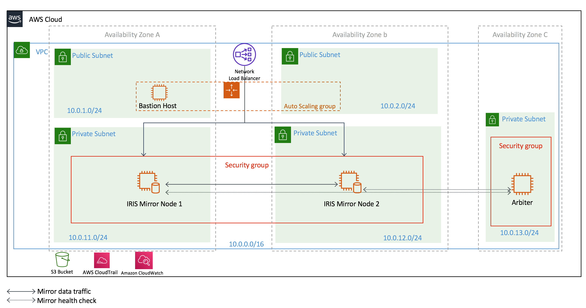

Deploying this Quick Start for a new virtual private cloud (VPC) with
default parameters builds the following {partner-product-short-name} environment in the
AWS Cloud.

// Replace this example diagram with your own. Send us your source PowerPoint file. Be sure to follow our guidelines here : http://(we should include these points on our contributors giude)
[#architecture1]
.Quick Start architecture for _{partner-product-short-name}_ on AWS

As shown in Figure 1, the Quick Start sets up the following:

* A highly available architecture that spans three Availability Zones.*
* A VPC configured with public and private subnets, according to AWS
best practices, to provide you with your own virtual network on AWS.*
* Two EC2 instances running as IRIS mirror nodes in two different Availability Zones.
* An EC2 instance in a third Availability Zone acting as a mirror arbiter.

In the public subnets:

* Managed network address translation (NAT) gateways to allow outbound
internet access for resources in the private subnets.*
* A Linux bastion host in an Auto Scaling group to allow inbound Secure
Shell (SSH) access to EC2 instances in public and private subnets.*
* A network load balancer.

*The template that deploys the Quick Start into an existing VPC skips
the components marked by asterisks and prompts you for your existing VPC
configuration.
