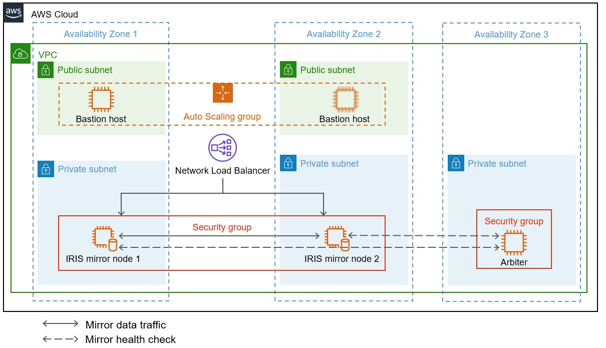

Deploying this Quick Start for a new virtual private cloud (VPC) with
default parameters builds the following {partner-product-short-name} environment in the
AWS Cloud.

// Replace this example diagram with your own. Send us your source PowerPoint file. Be sure to follow our guidelines here : http://(we should include these points on our contributors giude)
:xrefstyle: short
[#architecture1]
.Quick Start architecture for _{partner-product-short-name}_ on AWS

As shown in <<architecture1>>, the Quick Start sets up the following:

* A highly available architecture that spans three Availability Zones.*
* A VPC configured with public and private subnets, according to AWS
best practices, to provide you with your own virtual network on AWS.*
* In the public subnets:
** Managed network address translation (NAT) gateways (not shown) to allow outbound
internet access for resources in the private subnets.*
** A Linux bastion host in an Auto Scaling group to allow inbound Secure
Shell (SSH) access to Amazon Elastic Compute Cloud (Amazon EC2) instances in public and private subnets. If this bastion host becomes unavailable, a second host is provisioned.*
* In the private subnets:
** Two EC2 instances running as IRIS mirror nodes in a security group: node 1 in Availability Zone 1 and node 2 in Availability Zone 2. [Describe what the solid and dashed arrows represent, using the terms "mirror data traffic" and "mirror health check" as in the footnotes: ____.]
** One EC2 instance acting as a mirror arbiter in the third Availability Zone. [Describe what the dashed arrows represent, using the term "mirror health check" as in the footnotes: ____.]
* A Network Load Balancer, which distributes inbound traffic across the workload instances that you want to protect from outside access.
* Amazon CloudWatch, which _____.
* AWS CloudTrail, which ____.
* Amazon S3, which _____.

[.small]#*The template that deploys the Quick Start into an existing VPC skips the components marked by asterisks and prompts you for your existing VPC configuration.#

//TODO Dave, Please fill in the blanks in the preceding bullet list. 